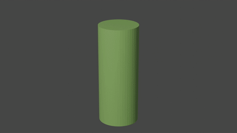

# 3D Morphing

Rust implementations of the following 3D morphing algorithm:

* Kent J R, Carlson W E, Parent R E. [Shape Transformation for Polyhedral Objects](https://dl.acm.org/ft_gateway.cfm?id=134007&ftid=29210&dwn=1&CFID=117160169&CFTOKEN=17cbb4352f5d8e85-99F18861-D850-D180-FAB1640B727FE717), Computer Graphics, 1992, 26(2):47~54

## Build

```
make
```

## Run

```
make run o1=<obj1> o2=<obj2>
```

## Usage

```
morphing

USAGE:
    morphing [FLAGS] [OPTIONS] <obj1> <obj2>

FLAGS:
    -e, --edge       Show edges only, no faces
    -h, --help       Prints help information
    -s, --scale      Scale models to the same scale
    -p, --shpere     All vertices are on the shpere, do not project back to the origin model
    -V, --version    Prints version information

OPTIONS:
    -o, --output <output>    Result model file (*.obj)
    -r, --ratio <ratio>      Morphing ratio [default: 0.5]

ARGS:
    <obj1>    Model file 1 (*.obj)
    <obj2>    Model file 2 (*.obj)
```


## Sone Results





