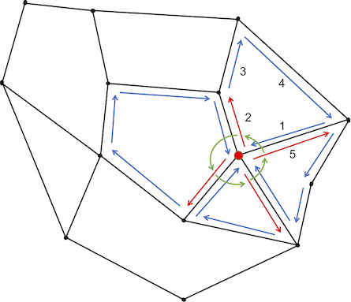
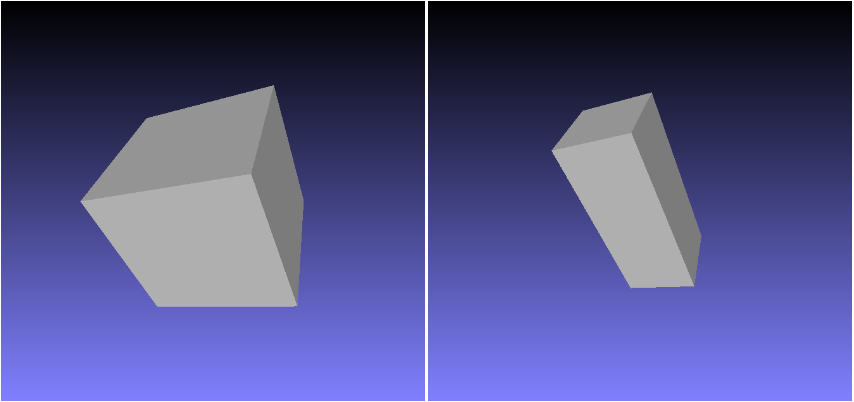
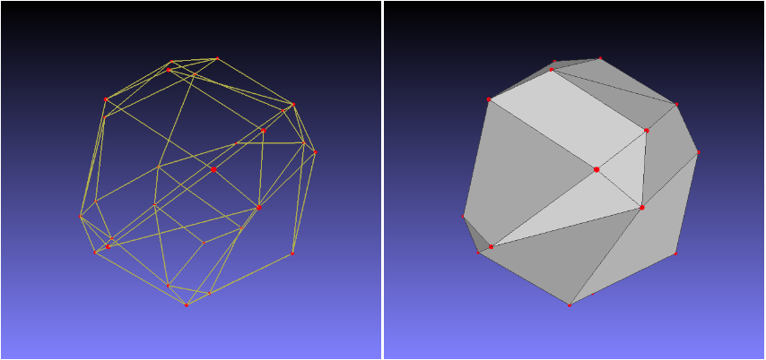
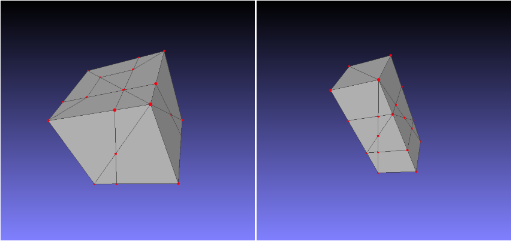
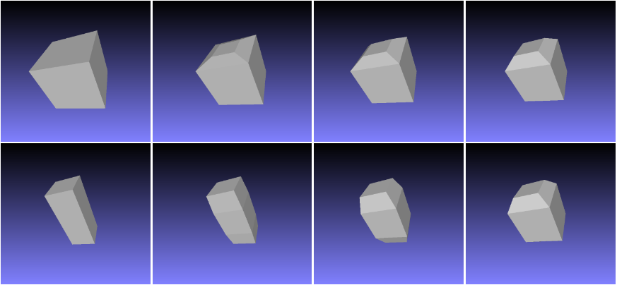

# 基于拓扑合并的三维morphing

## 算法简介

该算法通过合并拓扑结构将一个物体的形状变换为另外一个物体，主要分为下面几步：

1. 建立两物体顶点之间的对应关系：
    1. 将两物体的顶点投影到单位球面，并保持边的结构；
    2. 将投影后的拓扑结构在单位球面上合并，可能会对原来的边进行分割；
    3. 重建新拓扑结构的面；
    4. 将新的拓扑结构分别投影回原来两个物体。

2. 根据顶点已经一一对应的两个物体，通过插值计算变形中间过程的顶点坐标。

## 具体实现

算法的主体使用 [Rust](https://www.rust-lang.org/) 语言实现，编译和运行方法见 README.md]，主要功能是读入两个三维模型(OBJ 格式)，使用该算法将它们进行拓扑合并，将合并后的模型保存为文件，而插值和渲染的过程交给其他程序完成，这里使用的是 [Blender](https://www.blender.org/) 的 Python 脚本。

目录结构和主要文件功能：

* report.pdf：本报告
* render.py：Blender 渲染脚本
* models/：使用的三维模型
* results/：Blender 渲染结果
* src/：Rust 源代码
    + main.rs：主程序，解析命令行参数
    + graph.rs：定义了三维模型点、边形成的图
    + model.rs：对三维模型的处理，包括模型导入、导出，以及拓扑合并算法的主体
    + geo/：计算几何模块
        - vertex.rs：定义了三维空间顶点和对其的一系列运算，如四则远算、叉积、点积
        - arc.rs：实现了两球面圆弧的求交
        - triangle.rs：实现了射线与三角形面片的求交
        - face.rs：定义了一个三维模型的一个面(多边形)以及面方向的调整

### 投影到单位球面

首先选择以哪个点为中心。假设物体必须是星型多面体，即物体中至少存在一个点，从该点可以看到多面体的所有顶点而不被遮挡，则该点就可以作为中心点。对于凸多面体，里面任何一点都可以作为中心点；而对于一般星型多面体，需要使用半空间交等算法求出该点。为了方便，我们选则“尽量凸”的多面体，并直接将中心点设为所有顶点的平均值，也可以通过肉眼看出中心点的大致位置。

确定中心点后，将每个点都沿者它与中心点构成的射线平移，平移到以中心点为球心的单位球面上。

### 边的合并

现在两个物体的顶点都在单位球面上了，直接将点集进行合并。然后需要将两个物体的边也合并，边投影到球面上后是球面大圆的圆弧，两端点与球心共面，构成一个扇面。

考虑目前已经将第一个物体的所有边都加入了，现在正逐一加入第二个物体的边。这条边与之前已加入的边对应的圆弧可能会相交，此时需要求出交点，分割旧边，加入新点和新边。具体地，设当前边为 $e_2$，在已有的边中枚举 $e_1$，根据它们对应的圆弧的相交情况进行不同的处理，最后将 $e_2$ 上的所有交点按到一端点的距离排序，向相邻两交点之间连新一条边。对相交情况的处理如下：

1. 两圆弧共面：将 $e_1$ 删除，根据两圆弧的包含关系进行不同的连边处理。
2. $e_1$ 的一个端点在 $e_2$ 上：交点已在顶点集合中，不需要新建顶点；
3. $e_2$ 的一个端点在 $e_1$ 上：将 $e_1$ 删除，$e_1$ 两端点分别向该端点连边；
4. $e_2$ 的一个端点与 $e_1$ 的一个端点重合：为了尽量减少顶点重复，将 $e_2$ 的端点替换为 $e_1$ 的端点；
5. 规范相交：将交点作为新的顶点，将 $e_1$ 删除，$e_1$ 两端点分别向该交点连边；
6. 不相交：无需处理。

对于求球面两圆弧的交点，设两圆弧分别为 $AB$ 和 $CD$，使用以下算法：

1. 判是否共面；
2. 判端点是否重合；
3. 判是一圆弧的一端点是否在另一圆弧上；
3. 使用“跨立实验”判断相交，如果相交，使用下式求交点 $V$：

    $$
    \begin{aligned}
    \overrightarrow{n_{CD}} &= \overrightarrow{OC} \times \overrightarrow{OD} \\
    t &= \frac{\overrightarrow{OA} \cdot \overrightarrow{n_{CD}}}{\overrightarrow{OA} \cdot \overrightarrow{n_{CD}} - \overrightarrow{OB} \cdot \overrightarrow{n_{CD}}} \\
    &= \frac{\overrightarrow{OA} \cdot \overrightarrow{n_{CD}}}{\overrightarrow{BA} \cdot \overrightarrow{n_{CD}}} \\
    V' &= A + (B - A) \cdot t \\
    V &= \frac{|OC|}{|OV'|}V'
    \end{aligned}
    $$

共面和包含等关系的判断均可使用空间向量运算完成，详见源码，这里不再赘述。

### 投影回原物体

现在合并后模型的顶点都在单位球面上，还需将他们投影回原物体。对于单位球面上一点，从物体中心作一条经过该点的射线，求该射线与原多面体的哪个面有交点，则交点就是投影的结果。设原多面体已经过三角剖分，每面都是三角形，于是就成了三角形面片与射线求交问题。

设 $\triangle ABC$，射线 $OP$，则三角形法向量 $\overrightarrow{n} = \overrightarrow{AB} \times \overrightarrow{AC}$，射线与三角形所在平面的交点 $V$ 为：

$$
\begin{aligned}
t &= \frac{\overrightarrow{AO} \cdot \overrightarrow{n}}{\overrightarrow{AO} \cdot \overrightarrow{n} - \overrightarrow{AP} \cdot \overrightarrow{n}} \\
&= \frac{\overrightarrow{AO} \cdot \overrightarrow{n}}{\overrightarrow{PO} \cdot \overrightarrow{n}}
\end{aligned} \\
V = O + (P - O) \cdot t
$$

然后需要判断交点是否在三角形内部。可根据交点到相邻两三角形顶点的叉积和

$$
|\overrightarrow{VA} \times \overrightarrow{VB}| + |\overrightarrow{VB} \times \overrightarrow{VC}| + |\overrightarrow{VC} \times \overrightarrow{VA}|
$$

是否等于三角形的面积 $|\overrightarrow{n}|$ 进行判断。

### 面的重建

使用上面的算法，可以得到合并后模型的点与边，但是原模型的面被破坏了，需要根据边的关系来还原面的信息。这里使用了一种基于平面图求域的算法，对于星型多面体，可在线性时间内根据边的关系恢复出面的信息。

首先，合并后模型的顶点和边构成了一个图，且顶点都在单位球面上。如果将球面展开成一个平面，就是得到了平面图，求面相当于求平面图的域。对于平面图求域，可使用如下算法：

1. 将每条无向边变为两条有向边，称一条是另一条的对立边；
2. 对每个顶点，将从它出发的所有有向边给出相对顺序，记录每条边的下一条边，形成一个环(如图中红色边的顺序用绿色弧表示)。排序规则可设为与该顶点形成的极角大小；
3. 枚举每条有向边，则该边在其所在域中的相邻边，是该边对立边的下一条边(如图中边 1 的对立边是 5，5 的下一条边是 2)。一直这样找下去，直到遇到之前处理过的边，于是就找到了一个域。

对于三维的情况，关键是要对一个点出发的所有边给出正确的相对顺序。由于是星型多面体，从中心到任一顶点的射线不与其他面相交，使得顺序的确定变得比较容易。对于一个顶点，我们从该顶点向中心“看去”，求出该点连出的每条边的在这个方向上的投影，就转换为了平面的情况。具体地，设顶点坐标为 $A$，该顶点出发的一条边的坐标为 $B_i$，过点 $B_i$ 作 $OA$ 的垂线 $B_iC_i$，则所有的 $B_iC_i$ 都是共面的，可计算两两之间的夹角，则 $B_iC_i$ 与 $B_1C_1$ 之间夹角的大小就可以作为边排序依据。注意还需根据向量的前后顺序考虑夹角的正负。

得到面之后，需要对该面进行三角剖分。可简单地固定一个顶点，然后其他顶点连边即可。此外，还可能需要反转面上顶点的顺序，使得面的法向量是朝外的。

### 插值

使用上述算法，可以得到：

1. 将单位球面上的顶点投影回物体 1 表面后的坐标 $\mathbf{v_i}$；
2. 将单位球面上的顶点投影回物体 2 表面后的坐标 $\mathbf{u_i}$；
3. 这些顶点形成的面的信息。

将这些信息保存为文件，则对于不同的变形系数，只需读取该文件进行插值即可，而无需再次合并模型。

使用线性插值，设变形系数为 $\lambda (0 \le \lambda \le 1)$，则变形后物体的顶点坐标为：

$$
(1-\lambda) \mathbf{v_i} + \lambda \mathbf{u_i}
$$

## 效果

下面给出了算法执行过程中的一些中间结果。

### 原始物体

### 拓扑合并后的单位球上的顶点、边、面

### 投影回原物体

### 插值结果

从这个例子也可以看出，使用该算法求得的顶点对应关系并不够好，正确的对应关系应该是 8 个顶点各自进行对应，而不用加入新的顶点和边。

### 连续动画

result 目录中给出了更多的物体变形的视频，各视频都是先用以上算法求出拓扑合并后的模型，使用 Python 脚本(render.py)进行插值，然后使用 Blender 软件渲染得到的。

## 参考资料

* Kent J R, Carlson W E, Parent R E. Shape transformation for polyhedral objects. Computer Graphics, 1992, 26(2):47~54
* Cornell CS631 Final Project 3D Morphing: http://www.cs.cornell.edu/suwatch/3DMorph2.html
* 第三方库：
    + Blender：https://www.blender.org
